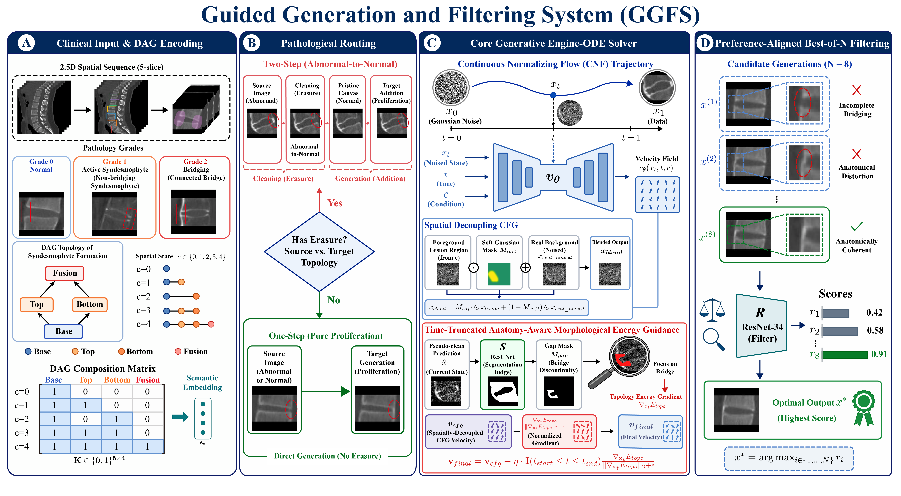

# GGFS: Guided Generation and Filtering System for Ankylosing Spondylitis

## Overview
Monitoring syndesmophyte evolution is imperative in Ankylosing Spondylitis (AS). However, traditional scoring systems lack sensitivity for subtle structural progression. This repository provides the official PyTorch implementation of **GGFS** (Guided Generation and Filtering System), a continuous 2.5D spatial evaluation protocol designed for precision radiographic monitoring. 

By combining a novel generative engine with a Hard Example Mining (HEM) strategy, this framework overcomes inherent medical data scarcity, establishing a robust computational foundation for multi-center clinical imaging analysis and AI-assisted diagnosis.

## Architecture

The GGFS pipeline consists of four core modules:

*   **Clinical Input & DAG Encoding (A):** Utilizes a Directed Acyclic Graph (DAG) composition matrix to map 5-grade pathological states into semantic embeddings, ensuring strict disentanglement of targeted pathological proliferation from the non-target anatomical background.
*   **Pathological Routing (B):** Implements a robust routing mechanism. For pure proliferation, it uses direct one-step generation. For demanding morphological transitions (e.g., bone bridge erasure), it employs a two-step cyclic pipeline (Abnormal $\rightarrow$ Normal $\rightarrow$ Target).
*   **Core Generative Engine & ODE Solver (C):** Drives the Continuous Normalizing Flow (CNF) trajectory. It dynamically injects a time-truncated anatomy-aware morphological energy guidance into the ODE velocity field to safely dismantle complex structures without topological collapse.
*   **Preference-Aligned Best-of-N Filtering (D):** Guarantees strict topological safety and anatomical preservation by scoring and filtering candidate generations using a specialized ResNet-34 evaluator.

## Key Clinical Enhancements

*   **Controllable Micro-Anatomical Synthesis:** Achieves state-of-the-art generative fidelity (FID = 2.81) and synthesizes micro-ossifications that pass expert visual Turing tests.
*   **HEM Augmentation:** Improves downstream model performance, increasing external test set Macro-AUC from 87.25% to 88.93%, and simulated prospective test set Macro-AUC from 89.42% to 90.52%.
*   **AI Copilot:** Achieves accurate patient-level severity regression (ICC = 0.955) and serves as an effective AI copilot, increasing clinician accuracy with ground truth from 0.878–0.919 to 0.967–0.980.

